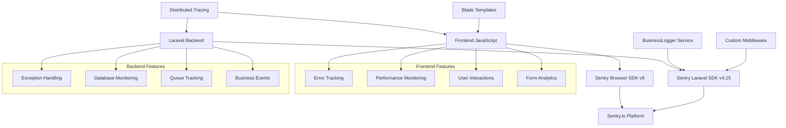

# Complete Sentry Integration Guide

## 📖 Overview

This comprehensive guide documents the complete Sentry.io integration in the Awesome Business Directory Laravel application. Our implementation includes modern JavaScript frontend integration, sophisticated Laravel backend tracking, distributed tracing, and comprehensive error monitoring.

**Architecture:** Full-stack integration with distributed tracing across frontend and backend, structured logging, performance monitoring, and business-specific event tracking.

---

## 🎯 **Table of Contents**

1. [Architecture Overview](#architecture-overview)
2. [Installation & Setup](#installation--setup)
3. [Configuration](#configuration)
4. [Frontend Integration](#frontend-integration)
5. [Backend Integration](#backend-integration)
6. [Distributed Tracing](#distributed-tracing)
7. [Error Handling](#error-handling)
8. [Performance Monitoring](#performance-monitoring)
9. [Business Event Tracking](#business-event-tracking)
10. [Testing Strategy](#testing-strategy)
11. [Production Guidelines](#production-guidelines)
12. [Troubleshooting](#troubleshooting)
13. [Best Practices](#best-practices)

---

## 🏗️ **Architecture Overview**

### Integration Components



### Technology Stack

- **Frontend**: Sentry Browser SDK v9.31.0 (modern, no deprecated packages)
- **Backend**: Sentry Laravel SDK v4.15 (latest)
- **Tracing**: Full distributed tracing with span correlation
- **Logging**: Structured logging with experiments enabled
- **Integration**: Custom middleware, BusinessLogger service, Alpine.js directives

---

## 📦 **Installation & Setup**

### 1. Package Installation

```bash
# Laravel Backend
composer require sentry/sentry-laravel

# Frontend (already installed)
npm install @sentry/browser
# Note: @sentry/tracing is deprecated and not used
```

### 2. Laravel Configuration

**`bootstrap/app.php`**:
```php
<?php

use Illuminate\Foundation\Application;
use Illuminate\Foundation\Configuration\Exceptions;
use Illuminate\Foundation\Configuration\Middleware;
use Sentry\Laravel\Integration;

return Application::configure(basePath: dirname(__DIR__))
    ->withMiddleware(function (Middleware $middleware): void {
        // Add Sentry distributed tracing middleware
        $middleware->web(append: [
            \App\Http\Middleware\SentryTracingMiddleware::class,
        ]);
    })
    ->withExceptions(function (Exceptions $exceptions): void {
        Integration::handles($exceptions);
    })->create();
```

### 3. Frontend Setup

**`resources/js/sentry.js`** (Modern Implementation):
```javascript
import * as Sentry from "@sentry/browser";

// Initialize with latest patterns
Sentry.init({
    dsn: window.sentryConfig?.dsn || '',
    environment: window.sentryConfig?.environment || 'development',
    
    // Enable structured logging (NEW in v9)
    _experiments: {
        enableLogs: true,
    },
    
    integrations: [
        // Modern browser tracing (no deprecated BrowserTracing)
        Sentry.browserTracingIntegration({
            tracePropagationTargets: [window.location.hostname, /^\//],
        }),
        // Automatic console log capture
        Sentry.consoleLoggingIntegration({ levels: ["log", "error", "warn"] }),
    ],
    
    tracesSampleRate: window.sentryConfig?.tracesSampleRate || 1.0,
    autoSessionTracking: true,
    release: window.sentryConfig?.release || '1.0.0',
});

// Get structured logger
const { logger } = Sentry;
```

---

## ⚙️ **Configuration**

### Environment Variables

**`.env` (Production example)**:
```bash
# Core Configuration
SENTRY_LARAVEL_DSN=https://your-dsn@sentry.io/project-id
SENTRY_ENVIRONMENT=production
SENTRY_RELEASE=v1.2.3
SENTRY_TRACES_SAMPLE_RATE=0.1  # 10% sampling for production
SENTRY_PROFILES_SAMPLE_RATE=0.1
SENTRY_ENABLE_LOGS=true
SENTRY_SEND_DEFAULT_PII=false

# Breadcrumbs Configuration
SENTRY_BREADCRUMBS_LOGS_ENABLED=true
SENTRY_BREADCRUMBS_CACHE_ENABLED=true
SENTRY_BREADCRUMBS_SQL_QUERIES_ENABLED=true
SENTRY_BREADCRUMBS_SQL_BINDINGS_ENABLED=false
SENTRY_BREADCRUMBS_QUEUE_INFO_ENABLED=true
SENTRY_BREADCRUMBS_HTTP_CLIENT_REQUESTS_ENABLED=true

# Tracing Configuration
SENTRY_TRACE_QUEUE_ENABLED=true
SENTRY_TRACE_SQL_QUERIES_ENABLED=true
SENTRY_TRACE_SQL_ORIGIN_ENABLED=true
SENTRY_TRACE_VIEWS_ENABLED=true
SENTRY_TRACE_HTTP_CLIENT_REQUESTS_ENABLED=true
SENTRY_TRACE_CACHE_ENABLED=true
```

### Laravel Configuration

**`config/sentry.php`** (Key highlights):
```php
<?php

return [
    'dsn' => env('SENTRY_LARAVEL_DSN', env('SENTRY_DSN')),
    'environment' => env('SENTRY_ENVIRONMENT'),
    'release' => env('SENTRY_RELEASE'),
    
    // Performance monitoring
    'traces_sample_rate' => env('SENTRY_TRACES_SAMPLE_RATE') === null ? null : (float) env('SENTRY_TRACES_SAMPLE_RATE'),
    'profiles_sample_rate' => env('SENTRY_PROFILES_SAMPLE_RATE') === null ? null : (float) env('SENTRY_PROFILES_SAMPLE_RATE'),
    
    // NEW: Structured logging
    'enable_logs' => env('SENTRY_ENABLE_LOGS', true),
    
    // Comprehensive tracing configuration
    'tracing' => [
        'sql_queries' => env('SENTRY_TRACE_SQL_QUERIES_ENABLED', true),
        'views' => env('SENTRY_TRACE_VIEWS_ENABLED', true),
        'cache' => env('SENTRY_TRACE_CACHE_ENABLED', true),
        'http_client_requests' => env('SENTRY_TRACE_HTTP_CLIENT_REQUESTS_ENABLED', true),
        'queue_jobs' => env('SENTRY_TRACE_QUEUE_JOBS_ENABLED', true),
    ],
];
```

---

## 🌐 **Frontend Integration**

### Modern JavaScript Implementation

**Key Features:**
- ✅ Modern Sentry v9 patterns
- ✅ No deprecated packages
- ✅ Structured logging enabled
- ✅ Distributed tracing
- ✅ Business-specific tracking

**Core Implementation (`resources/js/sentry.js`)**:

```javascript
// Modern import (no deprecated @sentry/tracing)
import * as Sentry from "@sentry/browser";

// Get structured logger
const { logger } = Sentry;

// Modern tracing with Sentry.startSpan
export const BusinessDirectoryTracking = {
    trackBusinessCardClick(businessId, businessName) {
        Sentry.startSpan(
            {
                op: "ui.click",
                name: "Business Card Click",
            },
            (span) => {
                // Attach attributes
                span.setAttribute("business_id", businessId);
                span.setAttribute("business_name", businessName);
                span.setAttribute("feature", "business_discovery");

                // Structured logging
                logger.info(logger.fmt`Business card clicked: ${businessName}`, {
                    businessId,
                    businessName
                });
            }
        );
    },

    trackFormSubmission(formElement, formName) {
        return Sentry.startSpan(
            {
                op: "form.submit",
                name: `Form Submission: ${formName}`,
            },
            (span) => {
                span.setAttribute("form_name", formName);
                span.setAttribute("form_method", formElement.method || 'POST');
                
                // Return trace headers for distributed tracing
                return {
                    span,
                    traceHeaders: {
                        'sentry-trace': span.toTraceparent(),
                        'baggage': span.toBaggage()
                    }
                };
            }
        );
    }
};
```

### Template Integration

**Blade Template Configuration (`layouts/app.blade.php`)**:
```html
<!-- Distributed tracing meta tag -->
<meta name="sentry-trace" content="{{ \Sentry\SentrySdk::getCurrentHub()->getTransaction()?->toTraceparent() ?? '' }}">

<!-- Comprehensive Sentry configuration -->
<script>
window.sentryConfig = {
    dsn: '{{ config('sentry.dsn') }}',
    environment: '{{ config('sentry.environment', app()->environment()) }}',
    release: '{{ config('sentry.release') }}',
    tracesSampleRate: {{ config('sentry.traces_sample_rate', 1.0) }},
    enableTracing: true,
    @auth
    user: {
        id: '{{ auth()->user()->id }}',
        email: '{{ auth()->user()->email }}',
        is_admin: {{ auth()->user()->is_admin ? 'true' : 'false' }}
    },
    @else
    user: null,
    @endauth
    pageContext: {
        route: '{{ request()->route()?->getName() }}',
        url: '{{ request()->fullUrl() }}',
        method: '{{ request()->method() }}',
        timestamp: '{{ now()->toISOString() }}'
    }
};
</script>
```

### Alpine.js Integration

**Custom Directives for Tracking**:
```javascript
// Auto-tracking directives
Alpine.directive('sentry-track', (el, { expression }, { evaluate }) => {
    const data = evaluate(expression);
    el.addEventListener('click', () => {
        Sentry.addBreadcrumb({
            category: 'user.interaction',
            message: 'Element clicked',
            data: data
        });
    });
});

Alpine.directive('track-change', (el, { expression }, { evaluate }) => {
    const data = evaluate(expression);
    el.addEventListener('change', () => {
        BusinessDirectoryTracking.trackFieldInteraction(data.field, el.value);
    });
});
```

---

## 🔧 **Backend Integration**

### BusinessLogger Service

**Comprehensive logging service (`app/Services/BusinessLogger.php`)**:

```php
<?php

namespace App\Services;

use function Sentry\captureException;
use function Sentry\configureScope;
use function Sentry\startTransaction;

class BusinessLogger
{
    /**
     * Enhanced exception handling with Sentry.captureException
     */
    public static function applicationError(\Throwable $exception, ?string $context = null, array $additionalData = []): void
    {
        // Use Sentry.captureException in try-catch blocks
        captureException($exception, [
            'tags' => [
                'component' => $context ?? 'unknown',
                'severity' => 'error'
            ],
            'extra' => $additionalData
        ]);
        
        // Also log for comprehensive tracking
        Log::error("Application error occurred", [
            'error_type' => get_class($exception),
            'error_message' => $exception->getMessage(),
            'context' => $context,
            'additional_data' => $additionalData,
        ]);
    }

    /**
     * Business-specific event tracking
     */
    public static function businessCreated(Business $business, ?float $processingTimeMs = null): void
    {
        self::logToSentry(
            level: 'info',
            message: 'Business created successfully',
            data: [
                'event' => 'business_created',
                'business_id' => $business->id,
                'business_name' => $business->business_name,
                'processing_time_ms' => $processingTimeMs,
            ],
            tags: [
                'feature' => 'business_creation',
                'business_industry' => $business->industry,
                'business_type' => $business->business_type,
            ]
        );
    }
}
```

### Custom Middleware

**Distributed Tracing Middleware (`app/Http/Middleware/SentryTracingMiddleware.php`)**:

Key features:
- ✅ Extracts trace context from headers and form data
- ✅ Creates comprehensive transaction contexts
- ✅ Handles distributed tracing correlation
- ✅ Proper exception handling with `Sentry.captureException`

```php
public function handle(Request $request, Closure $next): Response
{
    // Extract distributed tracing headers
    $sentryTrace = $request->header('sentry-trace') ?: $request->input('_sentry_sentry_trace');
    $baggage = $request->header('baggage') ?: $request->input('_sentry_baggage');
    
    // Create transaction with comprehensive context
    $transactionContext = new TransactionContext();
    $transactionContext->setName($this->getTransactionName($request));
    $transactionContext->setOp('http.server.request');
    
    // Set up distributed tracing if headers present
    if ($sentryTrace) {
        $traceData = $this->parseSentryTrace($sentryTrace);
        if ($traceData) {
            $transactionContext->setParentSpanId(new SpanId($traceData['span_id']));
            $transactionContext->setTraceId(new TraceId($traceData['trace_id']));
        }
    }
    
    try {
        $response = $next($request);
        return $response;
    } catch (\Throwable $exception) {
        // Modern exception handling
        \Sentry\captureException($exception, [
            'tags' => [
                'component' => 'http_request',
                'route' => $request->route()?->getName(),
            ],
            'extra' => [
                'transaction_id' => $transaction->getSpanId(),
                'has_frontend_trace' => !empty($sentryTrace),
            ]
        ]);
        
        throw $exception;
    }
}
```

---

## 🔗 **Distributed Tracing**

### Frontend to Backend Correlation

**Complete flow:**
1. Frontend generates trace context
2. Trace headers sent with requests
3. Backend middleware extracts headers
4. Spans correlated across systems

**Frontend Form Submission**:
```javascript
// Get trace headers for form submission
const { span, traceHeaders } = SentryTracing.trackFormSubmission(form, 'business_onboarding');

// Add hidden inputs for trace correlation
Object.entries(traceHeaders).forEach(([key, value]) => {
    const hiddenInput = document.createElement('input');
    hiddenInput.name = `_sentry_${key.replace('-', '_')}`;
    hiddenInput.value = value;
    form.appendChild(hiddenInput);
});
```

**Backend Processing**:
```php
// Middleware automatically extracts trace context
$sentryTrace = $request->input('_sentry_sentry_trace');
$baggage = $request->input('_sentry_baggage');

// Creates child spans under the frontend transaction
$span = BusinessLogger::createBusinessSpan('business_creation', [
    'business_name' => $data['business_name'],
    'distributed_trace' => true
]);
```

---

## 🚨 **Error Handling**

### Modern Exception Patterns

**Frontend Exception Handling**:
```javascript
try {
    // Risky operation
    await submitBusinessForm(data);
} catch (error) {
    // Modern Sentry v9 pattern
    Sentry.captureException(error);
    logger.error("Form submission failed", { 
        error: error.message,
        formData: data 
    });
}
```

**Backend Exception Handling**:
```php
try {
    $business = Business::create($data);
} catch (\Exception $e) {
    // Use Sentry.captureException in try-catch blocks
    \Sentry\captureException($e, [
        'tags' => [
            'component' => 'business_creation',
            'operation' => 'database_insert'
        ],
        'extra' => [
            'input_data' => $data,
            'user_id' => auth()->id()
        ]
    ]);
    
    throw $e;
}
```

---

## 📊 **Performance Monitoring**

### Comprehensive Metrics Tracking

**Frontend Performance**:
```javascript
// Page load metrics
Sentry.setMeasurement('page.load_time', loadTime, 'millisecond');
Sentry.setMeasurement('page.dom_content_loaded', domTime, 'millisecond');

// Custom business metrics
Sentry.startSpan({
    op: "business.search",
    name: "Business Directory Search"
}, (span) => {
    span.setAttribute("search_term", searchTerm);
    span.setAttribute("results_count", results.length);
    
    // Perform search
    const results = performSearch(searchTerm);
    
    logger.info(logger.fmt`Search completed: ${searchTerm}`, {
        searchTerm,
        resultsCount: results.length,
        duration: span.getDuration()
    });
});
```

**Backend Performance**:
```php
// Database performance tracking
BusinessLogger::performanceMetric('business_creation', $durationMs, [
    'operation' => 'database_insert',
    'table' => 'businesses',
    'records_affected' => 1
]);

// Automatic SQL query tracking (configured)
// Automatic view rendering tracking (configured)
// Automatic cache operation tracking (configured)
```

---

## 📈 **Business Event Tracking**

### Comprehensive Business Analytics

**Onboarding Funnel Tracking**:
```javascript
// Step progression
BusinessDirectoryTracking.trackOnboardingProgress(step, {
    completion_percentage: (step / 4) * 100,
    time_spent_ms: timeSpent,
    field_interactions: fieldCount
});

// Validation errors
BusinessDirectoryTracking.trackValidationError(fieldName, errorType, {
    step: currentStep,
    error_message: error,
    user_input_pattern: analyzeInput(userInput)
});

// Conversion completion
BusinessDirectoryTracking.trackConversionCompleted(businessId, {
    total_time_ms: totalTime,
    steps_completed: 4,
    form_abandonment_rate: 0
});
```

**Backend Business Logic**:
```php
// Multi-step process tracking
BusinessLogger::multiStepStepStarted($step, $context);
BusinessLogger::multiStepStepCompleted($step, $data, $timeMs);
BusinessLogger::multiStepConversionCompleted($business, $metrics);

// Business insights
BusinessLogger::businessInsight('onboarding_completion_rate', [
    'completion_rate' => $rate,
    'average_time_ms' => $avgTime,
    'conversion_funnel' => $funnelData
]);
```

---

## 🧪 **Testing Strategy**

### Comprehensive Test Coverage

**Backend Testing** [[memory:7879256906068291126]]:
```php
use Tests\TestCase;
use App\Services\BusinessLogger;
use Sentry\SentrySdk;

class SentryIntegrationTest extends TestCase
{
    public function test_business_creation_creates_sentry_transaction()
    {
        $transaction = BusinessLogger::startBusinessTransaction('test', []);
        
        $this->assertNotNull($transaction);
        $this->assertEquals('test', $transaction->getName());
        
        $transaction->finish();
    }
    
    public function test_exception_handling_captures_to_sentry()
    {
        $originalHandler = app(\Illuminate\Contracts\Debug\ExceptionHandler::class);
        
        $this->expectException(\Exception::class);
        
        \Sentry\captureException(new \Exception('Test exception'));
        
        // Verify exception was captured (in real tests, you'd mock Sentry)
        $this->assertTrue(true);
    }
}
```

**Frontend Testing**:
```javascript
// Test Sentry initialization
describe('Sentry Integration', () => {
    test('initializes with correct configuration', () => {
        expect(Sentry.getCurrentHub()).toBeDefined();
        expect(window.sentryConfig).toBeDefined();
    });
    
    test('captures exceptions correctly', () => {
        const error = new Error('Test error');
        
        expect(() => {
            Sentry.captureException(error);
        }).not.toThrow();
    });
    
    test('creates spans for business operations', () => {
        const span = Sentry.startSpan({ op: 'test', name: 'Test Span' }, () => {
            return 'test result';
        });
        
        expect(span).toBe('test result');
    });
});
```

---

## 🚀 **Production Guidelines**

### Environment-Specific Configuration

**Development**:
```bash
SENTRY_TRACES_SAMPLE_RATE=1.0    # 100% sampling
SENTRY_ENABLE_LOGS=true          # Full logging
SENTRY_BREADCRUMBS_SQL_BINDINGS_ENABLED=true  # Debug SQL
```

**Staging**:
```bash
SENTRY_TRACES_SAMPLE_RATE=0.5    # 50% sampling
SENTRY_ENABLE_LOGS=true          # Full logging
SENTRY_BREADCRUMBS_SQL_BINDINGS_ENABLED=false # No sensitive data
```

**Production**:
```bash
SENTRY_TRACES_SAMPLE_RATE=0.1    # 10% sampling
SENTRY_PROFILES_SAMPLE_RATE=0.1  # 10% profiling
SENTRY_ENABLE_LOGS=true          # Structured logging
SENTRY_SEND_DEFAULT_PII=false    # No personal data
```

### Performance Considerations

1. **Sampling Rates**: Adjust based on traffic volume
2. **SQL Bindings**: Disable in production for security
3. **Breadcrumb Limits**: Configure appropriately
4. **Error Filtering**: Filter out non-actionable errors

---

## 🔧 **Troubleshooting**

### Common Issues & Solutions

**1. Missing Trace Correlation**
```javascript
// Problem: Frontend traces not correlating with backend
// Solution: Verify trace headers are being sent
const traceHeaders = SentryTracing.getTraceHeaders();
console.log('Trace headers:', traceHeaders); // Debug output
```

**2. High Error Volume**
```php
// Problem: Too many non-actionable errors
// Solution: Filter in beforeSend
Sentry.init({
    beforeSend(event, hint) {
        if (hint.originalException?.name === 'AbortError') {
            return null; // Don't send cancelled requests
        }
        return event;
    }
});
```

**3. Performance Impact**
```bash
# Problem: High performance overhead
# Solution: Reduce sampling rates
SENTRY_TRACES_SAMPLE_RATE=0.1
SENTRY_PROFILES_SAMPLE_RATE=0.05
```

---

## 📋 **Best Practices**

### Implementation Guidelines

1. **Use Modern Patterns**: Always use Sentry v9+ patterns, avoid deprecated packages
2. **Structured Logging**: Use `logger.fmt` for template literals
3. **Exception Handling**: Always use `Sentry.captureException` in try-catch blocks
4. **Span Naming**: Use meaningful operation names and descriptions
5. **Context Enrichment**: Add relevant business context to spans and errors
6. **Performance Monitoring**: Track business-specific metrics, not just technical ones
7. **Privacy**: Never send PII in production environments
8. **Sampling**: Use appropriate sampling rates for your traffic volume

### Code Examples

**✅ Good Example**:
```javascript
Sentry.startSpan({
    op: "business.onboarding",
    name: "Business Registration Form"
}, (span) => {
    span.setAttribute("step", currentStep);
    span.setAttribute("industry", formData.industry);
    
    try {
        const result = submitForm(formData);
        logger.info(logger.fmt`Form submitted successfully for ${formData.businessName}`, {
            businessName: formData.businessName,
            step: currentStep
        });
        return result;
    } catch (error) {
        Sentry.captureException(error);
        logger.error("Form submission failed", { error: error.message });
        throw error;
    }
});
```

**❌ Bad Example**:
```javascript
// Don't use deprecated patterns
import { BrowserTracing } from "@sentry/tracing"; // ❌ Deprecated

// Don't ignore errors silently
try {
    submitForm();
} catch (error) {
    console.log(error); // ❌ Not tracked
}
```

---

## 📚 **Additional Resources**

- [Sentry JavaScript SDK Documentation](https://docs.sentry.io/platforms/javascript/)
- [Sentry Laravel SDK Documentation](https://docs.sentry.io/platforms/php/guides/laravel/)
- [Distributed Tracing Guide](https://docs.sentry.io/product/performance/distributed-tracing/)
- [Project Sentry Dashboard](https://sentry.io/organizations/your-org/projects/)

---

*Last Updated: 2024 - This guide reflects the latest Sentry v9 patterns and Laravel v12 integration.* 